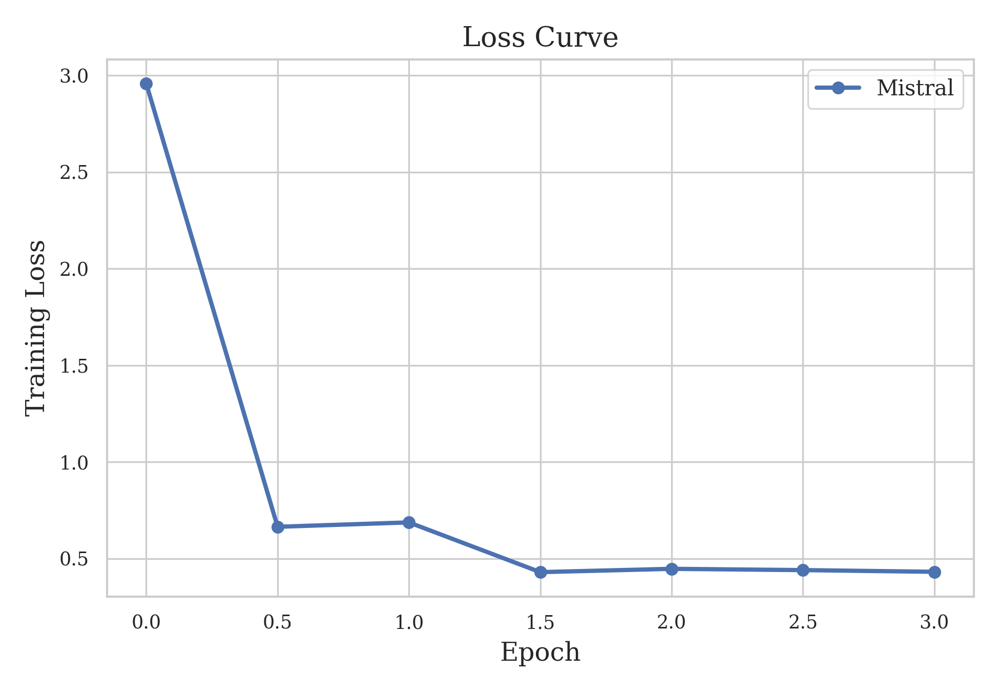
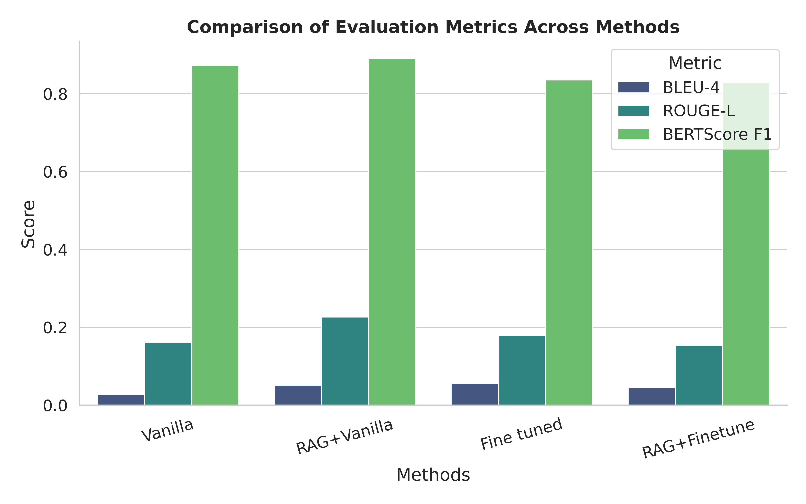

# Retrieval-Augmented Technical QA (RAG vs Fine-Tuning)


**Model:** https://huggingface.co/YOUR_HF_LINK
**Dataset:** https://www.kaggle.com/YOUR_KAGGLE_LINK
**Blog:** https://YOUR_BLOG_LINK

---

## Overview

This project investigates the effectiveness of **Retrieval-Augmented Generation (RAG)** and **parameter-efficient fine-tuning (LoRA)** for technical question answering across core Computer Science domains.

We evaluate four configurations of a large language model:

1. Vanilla Mistral
2. RAG + Vanilla
3. LoRA Fine-Tuned
4. RAG + Fine-Tuned

Key finding:

> Retrieval significantly improves both lexical and semantic answer quality, while aggressive fine-tuning can degrade semantic coherence due to catastrophic forgetting.

---

## Dataset

The dataset contains **technical interview question–answer pairs** across core CS domains such as data structures, operating systems, databases, and computer networks.

### Construction & Preprocessing

Dataset creation involved seed curation, synthetic expansion, and filtering:

| Stage                       | Samples  |
| --------------------------- | -------- |
| Initial dataset             | 2070     |
| Exact duplicates removed    | 51       |
| After deduplication         | 2019     |
| Semantic duplicates removed | 213      |
| **Final dataset**           | **1806** |

Semantic filtering used **MiniLM embeddings** with similarity threshold:

```
cosine similarity > 0.9
```

### Dataset Split

| Split      | Samples  |
| ---------- | -------- |
| Train      | 1264     |
| Validation | 270      |
| Test       | 272      |
| **Total**  | **1806** |

Dataset available here:

**Kaggle Dataset**

https://www.kaggle.com/YOUR_KAGGLE_LINK

---

## Model

Base model:

**Mistral-7B-Instruct**

Fine-tuning method:

**LoRA (Low-Rank Adaptation)**

Retrieval pipeline:

* Sentence Transformers (`all-MiniLM-L6-v2`)
* FAISS vector index
* Top-K semantic retrieval

Model available here:

**HuggingFace**

https://huggingface.co/YOUR_HF_LINK

---

## System Architecture

User Question
↓
Semantic Retrieval (FAISS)
↓
Context Injection
↓
LLM Generation
↓
Answer

---

## Training Curve



The LoRA model converges quickly due to the domain-specific dataset.

---

## Quantitative Results

| Model             | BLEU-4     | ROUGE-L   | BERTScore F1 |
| ----------------- | ---------- | --------- | ------------ |
| Vanilla           | 0.0274     | 0.213     | 0.929        |
| **RAG + Vanilla** | **0.0515** | **0.298** | **0.890**    |
| Fine-Tuned        | **0.0561** | 0.287     | 0.889        |
| RAG + Fine-Tuned  | 0.0380     | 0.252     | 0.871        |

Metric visualization:



---

## Experiments

<details>
<summary><strong>Vanilla Model</strong></summary>

Base **Mistral-7B-Instruct** used without modification.

</details>

<details>
<summary><strong>RAG + Vanilla</strong></summary>

Retrieval augmented inference using FAISS with MiniLM embeddings.

</details>

<details>
<summary><strong>Fine-Tuned Model</strong></summary>

LoRA-based domain adaptation using technical QA dataset.

</details>

<details>
<summary><strong>RAG + Fine-Tuned</strong></summary>

Retrieval applied on top of LoRA fine-tuned model.

</details>

---

## Example Inference

Examples illustrate the qualitative difference between **RAG + Vanilla** and **RAG + Fine-Tuned**.

| Question                      | RAG + Fine-Tuned                                | RAG + Vanilla                            |
| ----------------------------- | ----------------------------------------------- | ---------------------------------------- |
| Binary tree balanced check    | Off-topic explanation about BST and hash tables | Recursive height-based solution          |
| Pathway analysis              | Fragmented output                               | Correct biological pathway explanation   |
| JWT vs Session Cookies        | Incomplete sentence                             | Correct explanation about stateless APIs |
| Seasonality in data           | Empty output                                    | Correct time-series explanation          |
| Multiplayer game architecture | Truncated response                              | Structured client-server architecture    |

These examples demonstrate how **RAG + Vanilla produces more grounded and coherent responses.**

---

## Key Insight

The experiments reveal a **fine-tuning paradox**:

* Fine-tuning improves **lexical overlap metrics**
* Semantic coherence **degrades due to catastrophic forgetting**
* Retrieval grounding improves **both lexical and semantic quality**

Therefore:

**RAG + Vanilla LLM provides the most reliable configuration for technical QA tasks.**

---

## License

Released for **research and educational use**.
